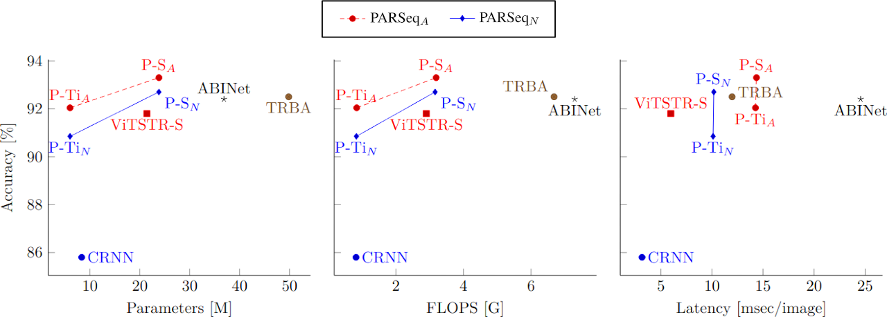
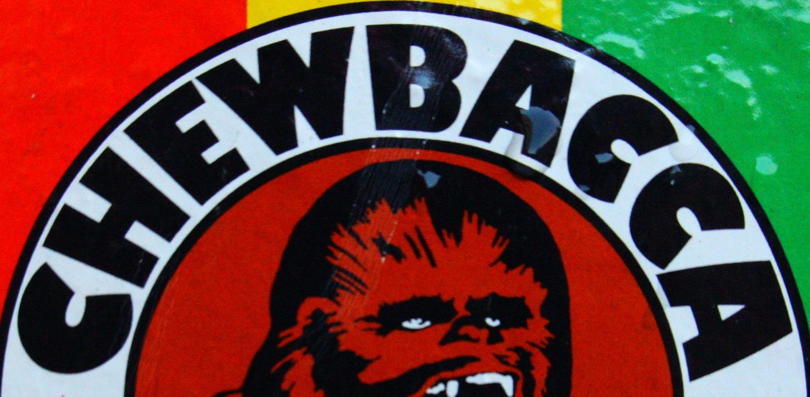
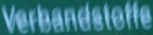
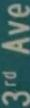
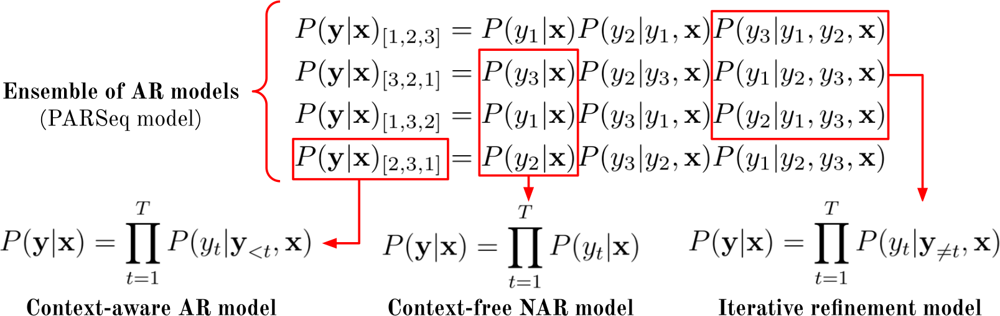
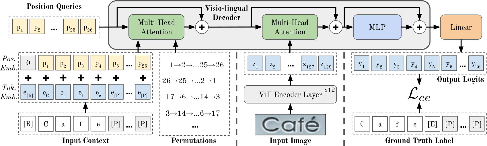

<div align="center">

# Scene Text Recognition with<br/>Permuted Autoregressive Sequence Models
[](https://github.com/baudm/parseq/blob/main/LICENSE)
[](https://arxiv.org/abs/2207.06966)
[](https://eccv2022.ecva.net/)
[](https://huggingface.co/spaces/baudm/PARSeq-OCR)

[**Darwin Bautista**](https://github.com/baudm) and [**Rowel Atienza**](https://github.com/roatienza)

Electrical and Electronics Engineering Institute<br/>
University of the Philippines, Diliman

</div>

Scene Text Recognition (STR) models use language context to be more robust against noisy or corrupted images. Recent approaches like ABINet use a standalone or external Language Model (LM) for prediction refinement. In this work, we argue that the external LM&mdash;which requires upfront allocation of dedicated compute capacity&mdash;is inefficient for STR due to its poor performance vs cost characteristics. We propose a more efficient approach using **P**ermuted **A**uto**r**egressive **Seq**uence (PARSeq) models.



The figure above shows word accuracy (94-character set) vs three common computational cost indicators. PARSeq-S (our base model) achieves state-of-the-art performance while being optimal in parameter count, FLOPS, and latency. Its downsized variant, PARSeq-Ti, also achieves high word accuracy while being comparable to CRNN in parameter count and FLOPS.

**NOTE:** _P-S and P-Ti are shorthands for PARSeq-S and PARSeq-Ti, respectively. For TRBA and PARSeq<sub>A</sub>, FLOPS and latency correspond to mean values measured on the benchmark._

### Sample Results
<div align="center">

| Input Image                                                                | PARSeq-S<sub>A</sub> | ABINet            | TRBA              | ViTSTR-S          | CRNN              |
|:--------------------------------------------------------------------------:|:--------------------:|:-----------------:|:-----------------:|:-----------------:|:-----------------:|
|          | CHEWBACCA            | CHEWBA**GG**A     | CHEWBACCA         | CHEWBACCA         | CHEW**U**ACCA     |
|         | Chevro**l**          | Chevro\_          | Chevro\_          | Chevr\_\_         | Chevr\_\_         |
|             | SALMON               | SALMON            | SALMON            | SALMON            | SA\_MON           |
|  | Verbandst**e**ffe    | Verbandst**e**ffe | Verbandst**ell**e | Verbandst**e**ffe | Verbands**le**ffe |
|           | Kappa                | Kappa             | Ka**s**pa         | Kappa             | Ka**ad**a         |
|           | 3rdAve               | 3=-Ave            | 3rdAve            | 3rdAve            | **Coke**          |

**NOTE:** _Bold letters and underscores indicate wrong and missing character predictions, respectively._
</div>

### Method tl;dr

Our main insight is that with an ensemble of autoregressive (AR) models, we could unify the current STR decoding methods (context-aware AR and context-free non-AR) and the bidirectional (cloze) refinement model:
<div align="center"></div>

The dynamic nature of attention masking in Transformers allows us to control and change information flow without modifying the model architecture. This characteristic coupled with Permutation Language Modeling (PLM) allows for a _unified_ STR model capable of context-free and context-aware inference, as well as iterative prediction refinement using bidirectional context **without** requiring a standalone language model. PARSeq can be considered an ensemble of AR models with shared architecture and weights:



## Getting Started
This repository contains the reference implementation for PARSeq and reproduced models (collectively referred to as _Scene Text Recognition Model Hub_). See `NOTICE` for copyright information.
Majority of the code is licensed under the Apache License v2.0 (see `LICENSE`) while ABINet and CRNN sources are
released under the BSD and MIT licenses, respectively (see corresponding `LICENSE` files for details).

### Demo
An [interactive Gradio demo](https://huggingface.co/spaces/baudm/PARSeq-OCR) hosted at Hugging Face is available. The pretrained weights released here are used for the demo.

### Installation
Requires Python 3.7 and PyTorch 1.10 or newer. Tested on Python 3.9 and PyTorch 1.10.
```bash
$ pip install -r requirements.txt
$ pip install -e .
 ```
### Datasets
Download the [datasets](Datasets.md) from the following links:
1. [LMDB archives](https://drive.google.com/drive/folders/1NYuoi7dfJVgo-zUJogh8UQZgIMpLviOE) for MJSynth, SynthText, IIIT5k, SVT, SVTP, IC13, IC15, CUTE80, ArT, RCTW17, ReCTS, LSVT, MLT19, COCO-Text, and Uber-Text.
2. [LMDB archives](https://drive.google.com/drive/folders/1D9z_YJVa6f-O0juni-yG5jcwnhvYw-qC) for TextOCR and OpenVINO.

### Pretrained Models via Torch Hub
Available models are: `abinet`, `crnn`, `trba`, `vitstr`, `parseq_tiny`, and `parseq`.
```python
import torch
from PIL import Image
from strhub.data.module import SceneTextDataModule

# Load model and image transforms
parseq = torch.hub.load('baudm/parseq', 'parseq', pretrained=True).eval()
img_transform = SceneTextDataModule.get_transform(parseq.hparams.img_size)

img = Image.open('/path/to/image.png').convert('RGB')
img = img_transform(img).unsqueeze(0)  # Preprocess. Shape: (B, C, H, W)

logits = parseq(img)
logits.shape  # torch.Size([1, 26, 95]), 94 characters + [EOS] symbol

# Greedy decoding
pred = logits.softmax(-1)
label, confidence = parseq.tokenizer.decode(pred)
```

## Training
The training script can train any supported model. You can override any configuration using the command line. Please refer to [Hydra](https://hydra.cc) docs for more info about the syntax. Use `./train.py --help` to see the default configuration.
```bash
./train.py model=parseq model.perm_num=12 model.embed_dim=512  # Set embed_dim to 512 instead of 384, use 12 permutations.
```

<details><summary>Sample commands for different training configurations</summary><p>

### Train a model variant/preconfigured experiment
The base model configurations are in `configs/model/`, while variations are stored in `configs/experiment/`.
```bash
./train.py +experiment=parseq-tiny  # Some examples: abinet-sv, trbc
```

### Specify the character set for training
```bash
./train.py charset=94_full  # Other options: 36_lowercase or 62_mixed-case. See configs/charset/
```

### Specify the training dataset
```bash
./train.py dataset=real  # Other option: synth. See configs/dataset/
```

### Change general model training parameters
```bash
./train.py model.img_size=[32, 128] model.max_label_length=25 model.batch_size=384
```

### Change data-related training parameters
```bash
./train.py data.root_dir=data data.num_workers=2 data.augment=true
```

### Change `pytorch_lightning.Trainer` parameters
```bash
./train.py trainer.max_epochs=20 trainer.gpus=2 +trainer.accelerator=gpu
```
Note that you can pass any [Trainer parameter](https://pytorch-lightning.readthedocs.io/en/stable/common/trainer.html),
you just need to prefix it with `+` if it is not originally specified in `configs/main.yaml`.

### Resume training from checkpoint (experimental)
```bash
./train.py +experiment=<model_exp> +ckpt_path=outputs/<model>/<timestamp>/checkpoints/<checkpoint>.ckpt
```

</p></details>

## Evaluation
The test script, ```test.py```, can be used to evaluate any model trained with this project. For more info, see ```./test.py --help```.

PARSeq runtime parameters can be passed using the format `param:type=value`. For example, PARSeq NAR decoding can be invoked via `./test.py parseq.ckpt refine_iters:int=2 decode_ar:bool=false`.

<details><summary>Sample commands for reproducing results</summary><p>

### Lowercase alphanumeric comparison on benchmark datasets (Table 6)
```bash
./test.py outputs/<model>/<timestamp>/checkpoints/last.ckpt  # or use the released weights: ./test.py /path/to/parseq.pt
```
**Sample output:**
| Dataset   | # samples | Accuracy | 1 - NED | Confidence | Label Length |
|:---------:|----------:|---------:|--------:|-----------:|-------------:|
| IIIT5k    |      3000 |    99.00 |   99.79 |      97.09 |         5.09 |
| SVT       |       647 |    97.84 |   99.54 |      95.87 |         5.86 |
| IC13_1015 |      1015 |    98.13 |   99.43 |      97.19 |         5.31 |
| IC15_2077 |      2077 |    89.22 |   96.43 |      91.91 |         5.33 |
| SVTP      |       645 |    96.90 |   99.36 |      94.37 |         5.86 |
| CUTE80    |       288 |    98.61 |   99.80 |      96.43 |         5.53 |
| **Combined** | **7672** | **95.95** | **98.78** | **95.34** | **5.33** |
--------------------------------------------------------------------------

### Benchmark using different evaluation character sets (Table 4)
```bash
./test.py outputs/<model>/<timestamp>/checkpoints/last.ckpt  # lowercase alphanumeric (36-character set)
./test.py outputs/<model>/<timestamp>/checkpoints/last.ckpt --cased  # mixed-case alphanumeric (62-character set)
./test.py outputs/<model>/<timestamp>/checkpoints/last.ckpt --cased --punctuation  # mixed-case alphanumeric + punctuation (94-character set)
```

### Lowercase alphanumeric comparison on more challenging datasets (Table 5)
```bash
./test.py outputs/<model>/<timestamp>/checkpoints/last.ckpt --new
```

### Benchmark Model Compute Requirements (Figure 5)
```bash
./bench.py model=parseq model.decode_ar=false model.refine_iters=3
<torch.utils.benchmark.utils.common.Measurement object at 0x7f8fcae67ee0>
model(x)
  Median: 14.87 ms
  IQR:    0.33 ms (14.78 to 15.12)
  7 measurements, 10 runs per measurement, 1 thread
| module                | #parameters   | #flops   | #activations   |
|:----------------------|:--------------|:---------|:---------------|
| model                 | 23.833M       | 3.255G   | 8.214M         |
|  encoder              |  21.381M      |  2.88G   |  7.127M        |
|  decoder              |  2.368M       |  0.371G  |  1.078M        |
|  head                 |  36.575K      |  3.794M  |  9.88K         |
|  text_embed.embedding |  37.248K      |  0       |  0             |
```

### Latency Measurements vs Output Label Length (Appendix I)
```bash
./bench.py model=parseq model.decode_ar=false model.refine_iters=3 +range=true
```

### Orientation robustness benchmark (Appendix J)
```bash
./test.py outputs/<model>/<timestamp>/checkpoints/last.ckpt --cased --punctuation  # no rotation
./test.py outputs/<model>/<timestamp>/checkpoints/last.ckpt --cased --punctuation --rotation 90
./test.py outputs/<model>/<timestamp>/checkpoints/last.ckpt --cased --punctuation --rotation 180
./test.py outputs/<model>/<timestamp>/checkpoints/last.ckpt --cased --punctuation --rotation 270
```

### Using trained models to read text from images (Appendix L)
```bash
./read.py outputs/<model>/<timestamp>/checkpoints/last.ckpt --images demo_images/*
Additional keyword arguments: {}
demo_images/art-01107.jpg: CHEWBACCA
demo_images/coco-1166773.jpg: Chevrol
demo_images/cute-184.jpg: SALMON
demo_images/ic13_word_256.png: Verbandsteffe
demo_images/ic15_word_26.png: Kaopa
demo_images/uber-27491.jpg: 3rdAve

# use NAR decoding + 2 refinement iterations for PARSeq
./read.py outputs/parseq/2021-10-28_23-23-10/checkpoints/last.ckpt refine_iters:int=2 decode_ar:bool=false --images demo_images/*
```
</p></details>

## Tuning

We use [Ray Tune](https://www.ray.io/ray-tune) for automated parameter tuning of the learning rate. Extend `tune.py` to support tuning of other hyperparameters.
```bash
./tune.py +tune.num_samples=20  # find optimum LR for PARSeq's default config using 20 trials
./tune.py +experiment=tune_abinet-lm  # find the optimum learning rate for ABINet's language model
```

## Citation
If you find our work useful, or use it in your research, please cite:
```bibtex
@InProceedings{Bautista_2022_ECCV_parseq,
  author={Bautista, Darwin and Atienza, Rowel},
  title={Scene Text Recognition with Permuted Autoregressive Sequence Models},
  booktitle={Proceedings of the 17th European Conference on Computer Vision (ECCV)},
  month={10},
  year={2022},
  publisher={Springer International Publishing},
  address={Cham}
}
```
